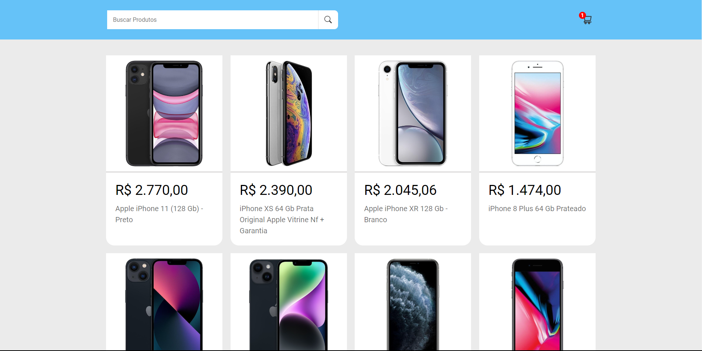

# Shopping Cart - Compras Online

Deploy: https://shopping-cart-qcaki67w1-leandrolsantos.vercel.app/

## Sobre

É um carrinho de compras para uso em qualquer tipo de busca de produtos. Estou iniciando este projeto através de estudos de códigos na Web e vídeos online. A intenção é praticar a criaçao de um carrinho de compras completo usando a API para mostrar os preços dos produtos. Estou usando a API que busca produtos do Mercado Livre e por padrão no momento deixei como exemplo a busca por iPhone.

### Objetivo

Aprimorar meus conhecimentos de React JS e API. Aprender a organizar melhor as pastas no REACT para que fique mais organizado e que fique fácil de alterar ou consertar caso ocorra eventuais erros no código. Entender como é a criação de um carrinho de compras e como funciona seu algoritmo. Aprender a importar da biblioteca do REACT e como instalar no projeto.

### Desafio

Este é mais um projeto que utilizo REACT, mas desta vez quero expandir meus conhecimentos. Estou conseguindo progredir bem, estou desenvolvendo no Windows então estou usando a identação LF para deixar tudo organizado. O REACT tem essa peculiaridade, pois se não tiver tudo organizado o código não funciona e acho isso um ponto positivo para esse framework/biblioteca de JS.

### Conclusão

Estou quase finalizando ainda falta criar o carrinho de compras e deixar a barra de search funcionando, mas o projeto está quase finalizado. Estou bastante feliz de como está ficando e sigo aprendendo bastante, em breve irei finalizar o projeto.

### Ferramentas Utilizadas

- REACT JS
- HTML
- CSS
- API